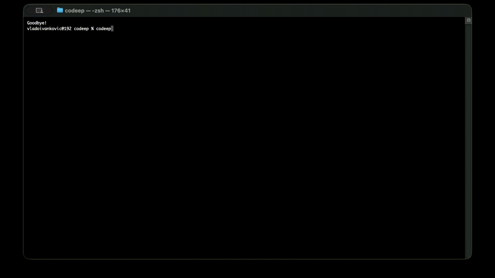

# Codeep

<p align="center">
  
</p>

<p align="center">
  <strong>Deep into Code.</strong>
</p>

<p align="center">
  
</p>

<p align="center">
  Autonomous AI coding agent that reads your project, runs commands, and writes &amp; verifies code — deeper than autocomplete. Any model (Claude, Gemini, DeepSeek, GLM, OpenAI, or your own local/custom), in the terminal and your editor.
</p>

<p align="center">
  <a href="https://www.npmjs.com/package/codeep"></a>
  <a href="https://www.npmjs.com/package/codeep"></a>
  <a href="https://github.com/VladoIvankovic/Codeep/blob/main/LICENSE"></a>
  <a href="https://github.com/VladoIvankovic/Codeep"></a>
</p>

## Upgrading from 1.x to 2.0

Most users **do not need to do anything** — `npm install -g codeep@latest`
picks up the new version and everything carries over (config, saved
profiles, project memory, MCP servers, skill bundles).

Two breaking changes only affect a small audience:

1. **MCP `clientInfo` version bumped from `1.4.0` → `2.0.0`.** If you
   maintain a custom MCP server that allowlists Codeep by version
   string, update your check.
2. **`McpServer` protocol shape** in ACP now has `command?`, `args?`,
   `url?`, `headers?` (transport-agnostic for stdio + Streamable HTTP).
   The old required-`command` shape is still accepted — parser handles
   both — but new clients should emit the optional shape.

See [CHANGELOG.md](CHANGELOG.md#200--2026-05-18) for the full list of
additions (full MCP support, OpenRouter provider with authoritative
per-call cost, Claude-Code-compatible skill bundles + web marketplace,
custom slash commands, lifecycle hooks, checkpoints, `/cost`,
`/compact`, and more).

## Features

### Multi-Provider Support
- **Z.AI (ZhipuAI)** — GLM models (Coding Plan & pay-per-use API, international & China)
- **OpenAI** — GPT models (flagship, Mini, Nano)
- **Anthropic** — Claude models (Fable, Opus, Sonnet, Haiku)
- **DeepSeek** — DeepSeek models (Pro, Flash)
- **Google AI** — Gemini models (Pro, Flash)
- **MiniMax** — MiniMax models (Coding Plan & pay-per-use API, international & China)
- **Ollama** — Run any model locally or on a remote server, no API key required. Models are fetched dynamically from your Ollama instance.
- **OpenRouter** — One key, 100+ models from Anthropic, OpenAI, Google, Meta, Mistral, DeepSeek, Qwen, xAI and more. Per-call cost reported directly by OpenRouter (matches their dashboard exactly). Use `openrouter/auto` to let OpenRouter pick the best model. Tune routing with `/openrouter prefer|ignore|fallbacks|privacy`.
- **Custom (OpenAI-compatible)** — Point Codeep at any self-hosted or proxied OpenAI-compatible endpoint (vLLM, LiteLLM, LM Studio, text-generation-webui). Set the base URL in `/settings` → **Custom Base URL** (config key `customBaseUrl`, e.g. `http://host:8000/v1`), then pick your model with `/model` (fetched from the server's `/models`). No API key required unless your endpoint enforces one. The `openai` provider also honors the `OPENAI_BASE_URL` env var for proxies that serve `gpt-*` model names.
- Switch between providers with `/provider`
- Configure different API keys per provider
- Both OpenAI-compatible and Anthropic API protocols supported

### Project Context Awareness
When started in a project directory, Codeep automatically:
- Detects project type (Node.js, Python, etc.)
- Reads file paths mentioned in your messages
- Attaches file contents to conversations
- Understands your project structure
- Can suggest and apply code changes (with write permission)

### Session Management
- **Auto-save** - Conversations are automatically saved
- **Session picker** - Choose which session to continue on startup
- **Per-project sessions** - Sessions stored in `.codeep/sessions/`
- **Rename sessions** - Give meaningful names with `/rename`
- **AI session titles** - Sessions auto-title themselves with an LLM one-liner ("OAuth2 migration for auth module") instead of a truncated first message. This makes one small background API call per session; turn it off with the `autoSessionTitle` setting (`/settings`) if you prefer zero unsolicited calls
- **Search current session** - Find text in the open conversation with `/search`
- **Cross-session recall** - `/recall <query>` searches across **all** saved sessions, ranked by relevance + recency. Add `--resume` to load the top match, or `--summarize` for an LLM recap of what you accomplished across matches
- **Export** - Save to Markdown, JSON, or plain text
- `/cost` - Per-session token usage and estimated cost (per provider/model)
- `/compact [keepN]` - AI-summarize older messages to free up context (keeps last N, default 4)
- `/checkpoint [name]` - Snapshot the current session (conversation + provider/model + agent-touched files + git HEAD)
- `/checkpoints` - List saved checkpoints for this workspace
- `/rewind <id>` - Restore a checkpoint; file rollback is handled via git (hint printed after rewind)

### Git Integration
- `/diff` - Review unstaged changes with AI assistance
- `/diff --staged` - Review staged changes
- `/commit` - Generate conventional commit messages

### Code Block Management
- Automatic syntax highlighting for 12+ languages
- Copy code blocks to clipboard with `/copy [n]`
- Code blocks are numbered for easy reference

### Clipboard Paste
- **`/paste` command** - Paste content from clipboard into chat
- Type `/paste` and press Enter to read clipboard content
- Shows preview with character/line count before sending
- Press Enter to send, Escape to cancel
- Works reliably in all terminals (no Ctrl+V issues)

### File Context (`/add`, `/drop`)
Explicitly add files to the conversation context:

- **`/add <path>`** - Add one or more files to context
- **`/add`** (no args) - Show currently added files
- **`/drop <path>`** - Remove a specific file from context
- **`/drop`** (no args) - Remove all files from context

Added files are automatically attached to every message (both chat and agent mode) until dropped. Useful for giving the AI specific files to work with.

```
> /add src/utils/api.ts src/types/index.ts
Added 2 file(s) to context (2 total)

> refactor the API client to use async/await
# AI sees both files attached to your message

> /drop
Dropped all 2 file(s) from context
```

### Multi-line Input
Write multi-line messages using backslash continuation or `/multiline` mode:

- **Backslash continuation** — end a line with `\` and press Enter to continue on the next line
- **`/multiline`** — toggle multi-line mode where Enter adds a new line and Esc sends the message

```
> Write a function that\
  takes two arguments and\
  returns their sum
# Sent as a single 3-line message

> /multiline
Multi-line mode ON — Enter adds line, Esc sends
M> (type freely, Enter = newline, Esc = send)
```

### Autonomous Agent Mode

Codeep works as a **full AI coding agent** that autonomously:
- Creates, edits, and deletes files
- Executes shell commands (npm, git, build, test, etc.)
- Reads and analyzes your codebase
- Loops until the task is complete
- Reports all actions taken
- **Live code display** - Shows syntax-highlighted code in chat as it writes/edits files

**Auto mode (default)**: Just describe what you want - no special commands needed:
```
> add error handling to src/api/index.ts
> run tests and fix any failures
> create a new React component for user settings
```

**Manual mode**: Use `/agent <task>` when you want explicit control.

> **Note for Ollama users:** Agent mode requires a capable model — at least **7B parameters** (e.g. `qwen2.5-coder:7b`, `llama3.1:8b`). Smaller models (1–3B) lack the instruction-following capacity for reliable tool use and may produce incorrect output. For small models, set Agent Mode to **Manual** or **Off** in `/settings`.

**Agent Tools:**
| Tool | Description |
|------|-------------|
| `read_file` | Read file contents |
| `write_file` | Create or overwrite files |
| `edit_file` | Edit specific text in files |
| `delete_file` | Delete files or directories |
| `create_directory` | Create folders |
| `list_files` | List directory contents |
| `execute_command` | Run shell commands |
| `search_code` | Search for patterns in code |
| `fetch_url` | Fetch content from URLs |

### Undo & History
- **Undo actions** - Revert any file change the agent made
- **Session history** - View and restore from previous agent sessions
- **Action tracking** - All file operations are logged for review

### Context Persistence
- **Save conversations** - Continue where you left off
- **Per-project context** - Each project maintains its own history
- **Automatic summarization** - When prior history overflows the agent's context budget, the dropped (oldest) messages are condensed into a short recap (decisions, constraints, unfinished threads) instead of being silently truncated — so long sessions don't forget how they started. One cheap LLM call, made only on overflow and cached per session; opt out with `autoSummarizeHistory: false` (`/settings`)

### Web & MCP Tools
- Agent can fetch documentation and web content
- Automatic HTML-to-text conversion
- **MCP-powered tools** (for Z.AI and Z.AI China providers):
  - `web_search` — Search the web for current information
  - `web_reader` — Fetch and read any web page
  - `zai_analyze_image` — Analyze images via Z.AI Vision (GLM-4V)
  - `minimax_understand_image` — Analyze images via MiniMax vision
- **Image paste** — Ctrl+V an image directly into the terminal to send it to a vision model
- MCP tools run as secure sub-processes with structured I/O

### Smart Context
Agent automatically gathers relevant files before making changes:
- Analyzes imports and dependencies
- Reads related type definitions
- Understands project structure
- Prevents duplicate code and inconsistencies

### Code Review Mode
AI-powered review of your git diff with `/review`:
- **Bugs** — logic errors, off-by-one, null/undefined issues
- **Security** — injection, auth issues, exposed secrets
- **Performance** — unnecessary loops, memory leaks
- **Edge cases** — unhandled inputs, missing error handling
- References file names and line numbers from the diff

```
> /review            # AI review of unstaged changes
> /review --staged   # AI review of staged changes
> /review --static   # Static regex analysis with score (0-100)
```

If there are no git changes, falls back to static analysis automatically.

#### Custom rules (`.codeep/review.yml` or `.codeep/review.json`)

The static reviewer (`codeep review` / `/review --static`) ships a set of
built-in rules, but a project can tailor them — check a `.codeep/review.yml`
(or `.codeep/review.json`) into the repo and the CLI **and** the
[Codeep GitHub Action](https://github.com/VladoIvankovic/codeep-action) both
pick it up automatically (zero LLM cost). YAML is preferred when present and is
nicer for regexes — single-quoted YAML keeps backslashes literal
(`pattern: '\bfoo\('`) so you avoid JSON's double-escaping:

```yaml
# .codeep/review.yml
rules:
  - id: no-internal-import
    pattern: "from ['\"]@acme/internal"
    category: best-practice
    severity: error
    message: Don't import from @acme/internal outside the platform team
    suggestion: Use the public @acme/sdk package
    extensions: [.ts, .tsx]
disable: [todo-comment, anonymous-function]
include: ['src/**']
exclude: ['**/*.test.ts', 'vendor/**']
```

The same config as JSON:

```json
{
  "rules": [
    {
      "id": "no-internal-import",
      "pattern": "from ['\"]@acme/internal",
      "category": "best-practice",
      "severity": "error",
      "message": "Don't import from @acme/internal outside the platform team",
      "suggestion": "Use the public @acme/sdk package",
      "extensions": [".ts", ".tsx"]
    }
  ],
  "disable": ["todo-comment", "anonymous-function"],
  "include": ["src/**"],
  "exclude": ["**/*.test.ts", "vendor/**"]
}
```

- **`rules`** — your own checks. `id`, `pattern` (a regex string), and `message`
  are required; `flags` (default `g`), `category`, `severity`
  (`error|warning|info|suggestion`), `suggestion`, and `extensions` are optional.
- **`disable`** — turn off built-in rules by id. Run `codeep review --rules` for
  the live list; the built-in ids are: `eval-usage`, `inner-html`,
  `dangerously-set-inner-html`, `hardcoded-password`, `hardcoded-api-key`,
  `foreach-await`, `await-in-loop`, `select-star`, `loose-null-check`,
  `empty-catch`, `console-statement`, `todo-comment`, `any-type`, `ts-ignore`,
  `as-any`, `var-usage`, `anonymous-function`, `missing-jsdoc`, `long-file`,
  `long-function`.
- **`include` / `exclude`** — glob scoping (`**`, `*`, `?`); `include` empty = all files.

A missing, malformed, or partially-invalid config never breaks a review — bad
entries are skipped and the run proceeds with whatever is valid.

**More review commands:**
- `codeep review --rules` — list the built-in rule ids (above) and exit.
- `codeep review --ai` — after the offline pass, get an advisory AI second
  opinion on the working-tree diff from your configured provider (needs an API
  key; never changes the exit code, so CI stays deterministic).
- `codeep hook install` — install a git pre-commit hook that reviews the
  working-tree content of your staged files and blocks the commit on failures
  (`--pre-push` for pre-push, `--fail-on <level>` to set the threshold,
  `codeep hook uninstall` to remove). Stage changes fully before committing.

### Interactive Mode
Agent asks clarifying questions when tasks are ambiguous:
```
You: "add authentication"
Agent: "What type of authentication do you want?
        a) JWT tokens
        b) Session-based
        c) OAuth (Google/GitHub)"
```

### Diff Preview
See exactly what will change before applying:
```diff
- const user = getUser();
+ const user = await getUser();
```

### Learning Mode
Agent learns your coding preferences:
- Indentation style (tabs/spaces)
- Quote style (single/double)
- Naming conventions
- Preferred libraries
- Custom rules you define

### User Profile (`/me`)
A durable, human-readable description of **you** that Codeep injects into the agent's context on every run — so it adapts to how you work (reply language, response style, default stack, "always / never" rules). It flows to every surface (terminal, VS Code, Zed) since they share the same files.

Two layers:
- **`~/.codeep/profile.md`** — global: who you are across all projects
- **`.codeep/profile.md`** — project: your role, goals, and constraints for this repo

Commands:
- `/me` — view your profile + status
- `/me init [project]` — scaffold a template to fill in
- `/me on` / `/me off` — toggle injection
- `/me learn [on|off]` — opt-in auto-learn: Codeep extracts durable preferences from sessions and merges them into `profile.learned.md` (kept separate from your hand-written file). Off by default.
- `/me learn project` — one-off learn scoped to this repo
- `/me forget` — clear the auto-learned profile(s)

Sync your global profile across machines (and edit it on the web) from the [dashboard](https://codeep.dev/dashboard): `/me sync` (or `codeep account sync`, which now carries the profile too). In VS Code: **Codeep: Edit Profile**, **Codeep: Toggle Profile Auto-Learn**, **Codeep: Sync Profile to Dashboard**.

### Sub-agents (delegation)
The agent can delegate a self-contained sub-task to a specialist **sub-agent** that runs in its own fresh context window and returns only a summary — keeping the main context small and letting each sub-task run with a tuned persona and scoped tools.

Built-ins:
- **`planner`** — read-only; investigates, then returns a step-by-step implementation plan
- **`researcher`** — read-only; explores the codebase/web and returns a tight, cited summary
- **`reviewer`** — read-only; senior review for correctness, security, and design
- **`tester`** — writes and runs tests, iterates to green

Run `/agents` to list them. The agent invokes them itself via the `delegate` tool (you'll see `⤷ <agent>: …` lines). Add your own with a frontmatter `.md` in `.codeep/agents/<name>.md` (project) or `~/.codeep/agents/<name>.md` (global):

```markdown
---
name: migrator
description: Writes and runs database migrations
tools: [read_file, write_file, edit_file, execute_command]   # allowlist; omit = all
model: glm-5.1            # optional override
personality: senior-reviewer   # optional preset
maxIterations: 12         # optional budget
---
You write safe, reversible DB migrations…
```

`tools` is an allowlist enforced at dispatch (a `researcher` literally can't write files). Sub-agents inherit your profile + project rules, and their changes are covered by `/undo`.

**Guaranteed review:** enable **Agent Auto-Review** in `/settings` (`agentAutoReview`) and after any run that changes files, Codeep automatically delegates to the `reviewer` and appends its findings — a review stage that always happens. Off by default.

### Project Rules
Define project-specific instructions that the AI always follows. Create a rules file in your project root:

- **`.codeep/rules.md`** - Primary location (inside `.codeep/` folder)
- **`CODEEP.md`** - Alternative location (project root, similar to `CLAUDE.md` or `.cursorrules`)

The rules file content is automatically included in every system prompt — both chat and agent mode. Use it to define:

- Coding standards and conventions
- Preferred libraries and frameworks
- Architecture guidelines
- Language-specific instructions
- Any custom rules for AI behavior in your project

**Example `.codeep/rules.md`:**
```markdown
## Code Style
- Use 2 spaces for indentation
- Prefer arrow functions
- Always use TypeScript strict mode

## Architecture
- Follow MVC pattern
- Keep controllers thin, logic in services
- All API responses use the ApiResponse wrapper

## Libraries
- Use Zod for validation
- Use date-fns instead of moment.js
```

Rules are loaded automatically when Codeep starts — no commands needed.

### Skills System
Predefined workflows for common development tasks. Execute with a single command:

```
/commit      - Generate commit message and commit
/test        - Generate tests for current code
/docs        - Add documentation to code
/refactor    - Improve code quality
/fix         - Debug and fix issues
/component   - Generate React/Vue component
/docker      - Generate Dockerfile
```

**50+ Built-in Skills:**

| Category | Skills |
|----------|--------|
| **Git** | `/commit` (`/c`), `/amend`, `/push` (`/p`), `/pull`, `/pr`, `/changelog`, `/branch`, `/stash`, `/unstash` |
| **Testing** | `/test` (`/t`), `/test-fix`, `/coverage`, `/e2e`, `/mock` |
| **Documentation** | `/docs` (`/d`), `/readme`, `/explain` (`/e`), `/api-docs`, `/translate` |
| **Refactoring** | `/refactor` (`/r`), `/types`, `/optimize` (`/o`), `/cleanup`, `/modernize`, `/migrate`, `/split`, `/rename` |
| **Debugging** | `/debug` (`/b`), `/fix` (`/f`), `/security`, `/profile`, `/log` |
| **Deployment** | `/build`, `/deploy`, `/release`, `/publish` |
| **Code Generation** | `/component`, `/api`, `/model`, `/hook`, `/service`, `/page`, `/form`, `/crud` |
| **DevOps** | `/docker`, `/ci`, `/env`, `/k8s`, `/terraform`, `/nginx`, `/monitor` |

**Shortcuts:** Many skills have single-letter shortcuts (shown in parentheses).

**Skill Parameters:** Many skills accept parameters:
```
/component UserCard              # Generate component named UserCard
/api users method=POST           # Generate POST endpoint for users
/migrate "React 18"              # Migrate to React 18
/model User fields=name,email    # Generate User model with fields
```

**Skill Chaining:** Run multiple skills in sequence with `+`:
```
/commit+push          # Commit then push
/test+commit+push     # Test, commit if pass, then push
/build+deploy         # Build then deploy
```

**Search Skills:**
```
/skills docker        # Find skills related to docker
/skills testing       # Find testing-related skills
```

**Custom Skills:** Create your own skills:
```
/skill create my-workflow        # Creates template in ~/.codeep/skills/
/skill delete my-workflow        # Delete custom skill
/skill help commit               # Show skill details
```

Custom skill example (`~/.codeep/skills/my-workflow.json`):
```json
{
  "name": "my-workflow",
  "description": "My custom workflow",
  "shortcut": "m",
  "parameters": [
    { "name": "target", "description": "Target environment", "required": true }
  ],
  "steps": [
    { "type": "command", "content": "npm run build" },
    { "type": "confirm", "content": "Deploy to ${target}?" },
    { "type": "agent", "content": "Deploy the application to ${target}" },
    { "type": "notify", "content": "Deployed to ${target}!" }
  ]
}
```

### MCP (Model Context Protocol)
Full spec coverage in 2.0.0 — stdio and Streamable HTTP transports,
tools / resources / prompts / sampling, capability negotiation with
`roots`, auto-restart on crash, mid-run catalog refresh.

**Three ways to wire MCP servers** (all merge; project > global > ACP wins last):

1. **Project config** — `.codeep/mcp_servers.json` (committed with the repo)
2. **Global config** — `~/.codeep/mcp_servers.json` (per machine)
3. **ACP client config** — Zed / Claude Desktop pass `mcpServers` on `session/new`

Two transports per entry, mutually exclusive:

```json
{
  "mcpServers": {
    "fs":     { "command": "npx", "args": ["@modelcontextprotocol/server-filesystem", "/path"] },
    "remote": { "url": "https://mcp.example.com/", "headers": { "Authorization": "Bearer …" } }
  }
}
```

Manage interactively from any Codeep client:

```bash
/mcp                            # list connected servers + tools + spawn errors
/mcp browse                     # 12 curated servers (filesystem, github, postgres, …)
/mcp browse <id>                # details + env-var hints for one entry
/mcp install <id> [extra args]  # wires it into project config + spawns
/mcp add <name> <command> [args]
/mcp remove <name>
/mcp reload                     # re-read config after a manual edit
/mcp resources                  # list resources servers expose
/mcp read <uri>                 # fetch one resource's contents
/mcp prompts                    # list prompt templates
/mcp prompt <server> <name> key=val
```

Resources and prompts also surface as **virtual tools** the agent can
call natively — `<server>__resource_list`, `<server>__resource_read`,
`<server>__prompt_list`, `<server>__prompt_get`. No need to type
`/mcp read` yourself; the model decides when to fetch.

If a server opts into the `sampling` capability, Codeep hosts LLM
completions on its behalf — routes through your active provider. If it
opts into `roots/list`, we expose the current workspace folder.

In the VS Code extension, the same operations are available from the
command palette (no JSON editing required):

- **Codeep: Add MCP Server…** — wizard that writes to project or global config
- **Codeep: Remove MCP Server…** — quick-pick from both scopes
- **Codeep: Open MCP Servers Config** — opens the JSON file directly

Each server is spawned as a child process; its tools are surfaced under
`<server>__<tool>`. MCP tool definitions are automatically injected into
the agent's tool catalog on each iteration, so the model picks them
alongside built-ins without you having to mention them by name.

Lifecycle is per-session: servers are torn down when the session is
deleted or the CLI exits (SIGTERM/SIGINT). The VS Code extension and the
direct `codeep` CLI both read the same config files, so a server you
configure once is available everywhere.

A server that crashes is auto-restarted (up to 3 times in a 60 s window,
with exponential backoff). Persistent failures are reported in `/mcp` so
you don't have to hunt through stderr. The `roots` capability is
advertised in the MCP handshake, so filesystem-shaped servers can
scope their reads to the current workspace.

Hooks apply to MCP tools too: `pre_tool_call` can block a `<server>__<tool>`
call, and `on_error` fires when it fails. See **Lifecycle Hooks** below.

### Lifecycle Hooks
Drop executable shell scripts in `.codeep/hooks/<event>.sh` and Codeep runs them at
the relevant moment during a session. Generalises what `agentAutoCommit` and
`agentAutoVerify` do — anything those can do, a `post_edit` hook can do too.

| Event | When | Blocking? |
|---|---|---|
| `pre_tool_call` | Before every agent tool call (including MCP `<server>__<tool>`) | **Yes** — non-zero exit blocks the call |
| `post_edit` | After `write_file` / `edit_file` succeeds (built-in only) | No (advisory: auto-format / auto-lint) |
| `on_error` | When any tool call fails (built-in or MCP) | No (logging / alerting) |
| `pre_commit` | Before the `/commit` skill stages anything | **Yes** — non-zero exit blocks the commit |

`pre_tool_call` and `on_error` apply uniformly to built-in tools (`read_file`,
`execute_command`, …) and MCP tools (`fs__read_file`, `gh__create_issue`, …).
A policy script can therefore allow-list or deny MCP calls just like any
other agent action.

Each hook receives `CODEEP_HOOK_EVENT`, `CODEEP_WORKSPACE`, `CODEEP_SESSION_ID`,
plus event-specific extras (`CODEEP_HOOK_TOOL`, `CODEEP_HOOK_PARAMS`, `CODEEP_HOOK_FILE`).

Example — auto-format on edit (`.codeep/hooks/post_edit.sh`):

```bash
#!/bin/bash
prettier --write "$CODEEP_HOOK_FILE" 2>/dev/null
```

Run `/hooks` to see which hooks are installed in the current workspace.

**Trust required (security).** Because hooks run arbitrary shell, a freshly
cloned repo's hooks are **not** run until you approve the workspace. Run
`/hooks trust` to enable them for the current project (revoke with
`/hooks untrust`); `/hooks` and the welcome banner show the trust state. Your
own projects just need a one-time `/hooks trust`. Global `~/.codeep/hooks/` are
never run for the same reason.

### Skill Bundles (new in 2.0)
Beyond the built-in skills and custom slash commands, Codeep now supports
**structured skill bundles** — directory-based capability packs the agent
discovers and invokes on its own.

A bundle is a directory `.codeep/skills/<name>/SKILL.md` (project-scoped)
or `~/.codeep/skills/<name>/SKILL.md` (global). The file is Markdown with
a YAML frontmatter header — the format is a **superset of Claude Code
skills**, so existing skills drop in unchanged:

```markdown
---
name: deploy-staging
description: Deploy the current branch to staging via npm scripts.
triggers: [deploy, ship, release]
# Optional Codeep-specific extensions:
codeep-min-version: 2.0.0
codeep-requires-mcp: [postgres]
allowed-tools: [read_file, write_file, execute_command]
version: 0.1.0
---

# deploy-staging

Run the test suite, build, then `npm run deploy:staging`. If the build
fails, surface the error and stop — don't deploy a broken build.
```

The agent gets the bundle catalog injected into its system prompt on
every iteration and can invoke any bundle via the `invoke_skill` tool:

- `/skills bundles` — list installed bundles
- `/skills create-bundle <name>` — scaffold a new project skill
- `/skills show <name>` — print the SKILL.md
- `/skills browse [query]` — search the public marketplace
- `/skills install <owner>/<slug>` — pull from marketplace
- `/skills publish <name> [--public]` — share to codeep.dev
- `/skills unpublish <owner>/<slug>` — remove your published skill

**Web marketplace:** publish skills to [codeep.dev/skills](https://codeep.dev/skills)
as public (browseable by anyone) or private (only you). Manage your published
skills at `/dashboard/skills`. From the VS Code extension, use the
**Codeep: Browse Skill Bundles…** / **Codeep: Create Skill Bundle…** /
**Codeep: Open Skills Folder** commands.

### Custom Slash Commands
Drop a Markdown file in `.codeep/commands/<name>.md` (project-scoped) or
`~/.codeep/commands/<name>.md` (global, all projects) and Codeep exposes it
as `/<name>` — in the TUI, Zed, and the VS Code extension. The body becomes
the user prompt; the agent handles it normally.

Example — `.codeep/commands/sec-review.md`:

```markdown
---
description: Security review of a file
aliases: [sec, secrev]
---

Please perform a thorough security review of {{args}}. Look for:
- AuthN/AuthZ bypasses, SQL/NoSQL injection, XSS, CSRF
- Path traversal, insecure deserialization
- Hardcoded secrets, race conditions

Report findings ordered by severity.
```

Then call it as `/sec-review src/api/login.ts` (or `/sec` via the alias).

**Placeholders** (Claude Code-compatible):
- `{{args}}` and `$ARGUMENTS` — full args string
- `{{arg1}}`, `{{arg2}}` … — positional args

**Discovery:** `/commands` lists all available templates. Project files shadow
global files with the same name. Aliases also work for autocomplete.

### Personalities (`/personality`, new in 2.0.3)

Swap how the agent talks and what it prioritises mid-conversation:

```
/personality                  # list available
/personality concise          # short answers, no preamble
/personality security         # treat every input as hostile
/personality senior-reviewer  # push back on shortcuts, name things well
/personality ship-it          # pick first reasonable approach
/personality off              # back to default tone
```

Six built-in presets: `concise`, `verbose`, `security`, `senior-reviewer`,
`junior-mentor`, `ship-it`. The active one persists across sessions
(stored in `~/.codeep/config.json` as `activePersonality`).

**Custom personalities** — drop a Markdown file in
`.codeep/personalities/<name>.md` (project) or
`~/.codeep/personalities/<name>.md` (global):

```markdown
# Personality: PR Reviewer

You are reviewing a PR from a junior engineer:
- Cite line numbers for every concern.
- Suggest an alternative, don't just flag the problem.
- Keep tone collaborative, not pedantic.
- End with one thing the author did well.
```

First `# Personality:` line is the display name; the rest is appended
to the agent's system prompt verbatim when active. Project shadows
global shadows built-in (by name).

### Activity Insights (`/insights`, new in 2.0.3)

Summarise what the agent has actually done for you over a window — runs,
tool actions, projects touched, most-edited files — sourced from
`~/.codeep/history/<id>.json` (one file per agent run, automatic).

```
/insights                 # last 7 days (default)
/insights --days 30       # last month
/insights --days 1        # today only
```

Surfaces (markdown rendered in chat):

- Headline tally: runs · actions · active time · active-days density · avg actions/run
- **By project** sorted by active time
- **Top tools** (read_file × 340, write_file × 80, …)
- **Most-touched files** (with `~` prefix for readability)
- **Recent runs** — 10 most recent with project, duration, and the user prompt that started them

Cost / token usage isn't in `/insights` (it lives in `/cost` per-session
since the token tracker is in-memory). Insights is history-only.

### Project Intelligence (`/init`, `/scan`)

Initialize a project and scan it once to cache deep analysis for faster AI responses:

```
/init          # Initialize project — creates .codeep/ folder
/scan          # Full project scan - analyzes structure, dependencies, patterns
/scan status   # Show last scan info (age, file count, project type)
/scan clear    # Clear cached intelligence
/memory <note>        # Add a custom note to project intelligence
/memory list          # Show all notes with indices
/memory remove <n>    # Remove note by index
/memory clear         # Clear all notes
```

**What gets analyzed and cached:**

| Category | Information |
|----------|-------------|
| **Structure** | File count, directory tree, language distribution (respects `.gitignore`) |
| **Dependencies** | Runtime & dev dependencies, detected frameworks |
| **Architecture** | Patterns (MVC, Component-based), main modules, entry points |
| **Scripts** | Available npm/composer/make scripts |
| **Conventions** | Indentation style, quotes, semicolons, naming conventions |
| **Testing** | Test framework, test directory location |
| **DevOps** | CI/CD system (GitHub Actions, GitLab CI, CircleCI, Azure, Travis, Jenkins, Drone), containerization (Docker, docker-compose, Kubernetes, Helm), monorepo tooling (Turborepo, Nx, Lerna, pnpm/Yarn workspaces, Rush) |

**Benefits:**
- AI understands your project deeply without re-analyzing each time
- Faster responses - no need to scan files repeatedly  
- Consistent context across sessions
- Framework-aware suggestions (React, Vue, Express, Django, etc.)

You can also add your own notes to the project intelligence with `/memory`:

```
/memory Always use pnpm, never npm
/memory Main entry point is src/renderer/main.ts
/memory Database migrations are in db/migrations/
```

Notes are included in every AI and agent conversation for this project.

**Storage:** `.codeep/intelligence.json` (project-local)

**Example output:**
```
# Project: my-app
Type: TypeScript/Node.js

## Structure
- 156 files, 24 directories
- Languages: TypeScript React (89), TypeScript (45), JSON (12)
- Main directories: src, components, utils, hooks

## Frameworks
React, Next.js

## Architecture
Patterns: Component-based, File-based routing
Main modules: src, components, hooks, utils

## Available Scripts
- dev: next dev
- build: next build
- test: vitest

## Code Conventions
- Indentation: spaces
- Quotes: single
- Semicolons: no
- Naming: camelCase

## DevOps
- CI/CD: GitHub Actions
- Containerization: Docker, docker-compose
- Monorepo: Turborepo
```

### Self-Verification (Optional)
When enabled in Settings, the agent can automatically verify its changes by running build, tests, or type checking after completing a task. Disabled by default — the agent works freely and you decide when to verify.

Configure in **Settings → Agent Auto-Verify**:
- **Off** (default) — no automatic verification
- **Build only** — checks compilation after changes
- **Typecheck only** — runs TypeScript/PHP type checking
- **Test only** — runs test suite after changes
- **Build + Typecheck + Test** — full verification

If errors are found, the agent tries to fix them automatically (up to 3 attempts, configurable).

**Supported project types:**

| Language | Build | Test | Type Check |
|----------|-------|------|------------|
| **Node.js/TypeScript** | npm/yarn/pnpm/bun run build | npm test, vitest, jest | tsc --noEmit |
| **Python** | - | pytest | - |
| **Go** | go build | go test | - |
| **Rust** | cargo build | cargo test | - |
| **PHP/Laravel** | composer run build | phpunit, artisan test | php -l (syntax) |

### Security Features
- API keys stored securely (macOS Keychain / Linux Secret Service)
- Per-project permissions (read-only or read-write)
- Input validation and sanitization
- Configurable rate limiting
- Agent sandboxed to project directory
- Dangerous commands blocked (rm -rf /, sudo, etc.)
- Configurable confirmation per tool — choose which agent actions require approval via `/settings`

## Codeep Dashboard

Link your CLI to [codeep.dev](https://codeep.dev/dashboard) for a personal web dashboard with session stats, project tracking, task management, and API key sync.

```bash
codeep account   # Opens browser → sign in with GitHub → CLI is linked
```

### Dashboard features

- **Usage stats** — total sessions, active this week, model/provider breakdown, token usage, estimated cost per model, 30-day trend
- **Projects** — all projects Codeep was used in, with language tag and git indicator
- **Project archiving** — hide projects from the list with one click
- **Tasks** — create/complete bug, feature, and task items from the web or directly from the CLI with `/tasks add` and `/tasks done`
- **API key sync** — store provider keys securely on codeep.dev, sync to any machine in one command
- **Personal config sync** — personalities and custom slash commands sync across machines; view and prune them on the dashboard
- **Connected devices** — see all machines linked to your account (hostname, last seen), revoke access per device

### API key sync

Add keys once on the dashboard, then sync them to any machine:

```bash
codeep account sync   # Pull keys + config from codeep.dev → local
codeep account push   # Push local keys + config → codeep.dev
```

Keys are encrypted at rest using AES-256-GCM.

### Personal config sync

`account sync` / `account push` also carry your **personalities** and **custom
slash commands** between machines — the Markdown files in
`~/.codeep/personalities/` and `~/.codeep/commands/`:

```bash
codeep account push   # Upload local personalities + commands to codeep.dev
codeep account sync   # Download them onto a new machine
```

Merging is **additive** — `sync` only writes files that don't already exist
locally, so it never clobbers a personality or command you've edited on this
machine. View what's synced (and prune stale entries) under **Personalities**
and **Custom commands** on the [dashboard](https://codeep.dev/dashboard).

Hooks and MCP server configs are deliberately **not** synced: hooks run
arbitrary shell, and MCP configs often embed tokens, so both stay local to each
machine.

### Privacy & telemetry

Once your CLI is linked, Codeep automatically uploads usage stats (model,
provider, token counts, estimated cost), session transcripts, `progress.md`,
and project memory notes to power your dashboard. To opt out of **all** of these
automatic uploads:

```bash
export CODEEP_NO_TELEMETRY=1   # also honors the cross-tool DO_NOT_TRACK=1
```

…or set it permanently in `~/.codeep/config.json`:

```json
{ "telemetry": false }
```

With telemetry off, nothing is uploaded automatically — the agent still runs
fully and talks to your LLM provider directly. Explicit `codeep account push` /
`account sync` commands are always under your control and are never gated by
this flag.

### Tasks

Create, view, and complete tasks directly from the CLI — or manage them on the codeep.dev dashboard:

```
> /tasks                    # List pending tasks for current project (numbered)
> /tasks add Fix login bug  # Create a new task on the dashboard
> /tasks done 2             # Mark task #2 as done
> /tasks delete 2           # Delete task #2 permanently
```

Tasks are loaded into the agent context so the AI sees them automatically on the next message.

## Installation

### Option 1: curl (Quickest)

```bash
curl -fsSL https://raw.githubusercontent.com/VladoIvankovic/Codeep/main/install.sh | bash
```

**Custom installation directory:**
```bash
curl -fsSL https://raw.githubusercontent.com/VladoIvankovic/Codeep/main/install.sh | INSTALL_DIR=~/.local/bin bash
```

**Specific version:**
```bash
curl -fsSL https://raw.githubusercontent.com/VladoIvankovic/Codeep/main/install.sh | VERSION=1.0.0 bash
```

### Option 2: Homebrew (macOS/Linux)

```bash
brew tap VladoIvankovic/codeep
brew install codeep
```

**Update:**
```bash
brew upgrade codeep
```

### Option 3: npm

```bash
npm install -g codeep
```

**Update:**
```bash
npm update -g codeep
```

### Option 4: Manual Binary

Download the latest binary for your platform from [GitHub Releases](https://github.com/VladoIvankovic/Codeep/releases):

| Platform | Binary |
|----------|--------|
| macOS Apple Silicon (M1/M2/M3/M4) | `codeep-macos-arm64` |
| macOS Intel | `codeep-macos-x64` |
| Linux x86_64 | `codeep-linux-x64` |

```bash
# Example for macOS Apple Silicon:
curl -fsSL https://github.com/VladoIvankovic/Codeep/releases/latest/download/codeep-macos-arm64 -o codeep
chmod +x codeep
sudo mv codeep /usr/local/bin/
```

## Quick Start

```bash
# Navigate to your project directory
cd /path/to/your/project

# Start Codeep
codeep

# On first run, enter your API key
# Get one at: https://z.ai/subscribe?ic=NXYNXZOV14
```

After installation, `codeep` is available globally in your terminal. Simply run it from any project directory to start coding with AI assistance.

## Commands

### General

| Command | Description |
|---------|-------------|
| `/help` | Show help and available commands |
| `/status` | Show current configuration status |
| `/version` | Show version and current provider/model |
| `/update` | Check for updates |
| `/clear` | Clear chat history and start new session |
| `/exit` or `/quit` | Quit application |

### AI Configuration

| Command | Description |
|---------|-------------|
| `/provider` | Switch AI provider |
| `/model` | Switch AI model |
| `/model <name>` | Load a saved profile shortcut (e.g. `/model fast`) |
| `/protocol` | Switch API protocol (OpenAI/Anthropic) |
| `/lang` | Set response language (12 languages supported) |
| `/settings` | Adjust temperature, max tokens, timeout, rate limits |
| `/profile save <name>` | Save current provider+model as a named profile |
| `/profile load <name>` | Load a saved profile |
| `/profile <name>` | Shorthand for `/profile load <name>` |
| `/profile list` | List all saved profiles |
| `/profile delete <name>` | Delete a saved profile |
| `/cost` `/stats` | Show session token usage and estimated API cost per model |

**Model favorites** — save provider+model combos and switch instantly:
```
> /provider      # switch to z.ai
> /model glm-5.1
> /profile save fast

> /provider      # switch to openai
> /model gpt-4.1
> /profile save work

> /model fast    # instantly switch to z.ai / glm-5.1
> /model work    # instantly switch to openai / gpt-4.1
```

### Session Management

| Command | Description |
|---------|-------------|
| `/sessions` | List and load saved sessions |
| `/sessions delete <name>` | Delete a specific session |
| `/rename <name>` | Rename current session |
| `/search <term>` | Search through chat history |
| `/export` | Export chat to MD/JSON/TXT format |

### Code & Files

| Command | Description |
|---------|-------------|
| `/apply` | Apply file changes from AI response |
| `/copy [n]` | Copy code block to clipboard (n = block number, -1 = last) |
| `/paste` | Paste content from clipboard into chat |
| `/add <path>` | Add file(s) to conversation context |
| `/drop [path]` | Remove file (or all) from context |
| `/multiline` | Toggle multi-line input mode |

### Agent Mode

| Command | Description |
|---------|-------------|
| `/grant` | Grant write permission for agent (opens permission dialog) |
| `/agent <task>` | Run agent for a specific task (manual mode) |
| `/agent-dry <task>` | Preview what agent would do without executing |
| `/agent-stop` | Stop a running agent |
| `/undo` | Undo the last agent action |
| `/undo-all` | Undo all actions from current session |
| `/history` | Show recent agent sessions |
| `/changes` | Show all file changes from current session |
| `/settings` | Configure confirmation mode and which tools require approval |

**Confirmation mode** (set via `/settings → Agent Confirmation`):

| Mode | Behavior |
|------|----------|
| `dangerous` (default) | Ask before configurable dangerous tools |
| `always` | Ask before every action |
| `never` | Execute without asking |

In `dangerous` mode, configure which tools require confirmation via `/settings`:
- **Confirm: delete_file** — ON by default
- **Confirm: execute_command** — ON by default
- **Confirm: write_file / edit_file** — OFF by default

### Git Integration

| Command | Description |
|---------|-------------|
| `/diff` | Review unstaged git changes |
| `/diff --staged` | Review staged git changes |
| `/commit` | Generate commit message for staged changes |
| `/git-commit [msg]` | Commit current changes with message |
| `/push` | Push to remote repository |
| `/pull` | Pull from remote repository |

### Context Persistence

| Command | Description |
|---------|-------------|
| `/context-save` | Save current conversation for later |
| `/context-load` | Load previously saved conversation |
| `/context-clear` | Clear saved context for this project |

### Code Review & Learning

| Command | Description |
|---------|-------------|
| `/review` | AI code review of unstaged git diff |
| `/review --staged` | AI code review of staged changes |
| `/review --static` | Static regex analysis with score (0-100) |
| `/learn` | Learn preferences from project files |
| `/learn status` | Show learned preferences |
| `/learn rule <text>` | Add a custom coding rule |

### Project Intelligence

| Command | Description |
|---------|-------------|
| `/init` | Initialize project (creates `.codeep/` folder) |
| `/scan` | Scan project and cache intelligence for AI |
| `/scan status` | Show last scan info |
| `/scan clear` | Clear cached intelligence |
| `/memory <note>` | Add a custom note to project intelligence |
| `/memory list` | Show all notes with indices |
| `/memory remove <n>` | Remove note by index |
| `/memory clear` | Clear all notes |
| `/model pull <name>` | Pull an Ollama model (local Ollama only) |
| `/model browse` | Browse a curated catalog of local coding models and pull one (Ollama) |
| `/model rm <name>` | Remove a locally-installed Ollama model (local only) |

### Skills

| Command | Description |
|---------|-------------|
| `/skills` | List all available skills |
| `/skills <query>` | Search skills by keyword |
| `/skills stats` | Show skill usage statistics |
| `/skill <name>` | Execute a skill (e.g., `/skill commit`) |
| `/skill <name> <params>` | Execute skill with parameters |
| `/skill help <name>` | Show skill details and steps |
| `/skill create <name>` | Create a new custom skill |
| `/skill delete <name>` | Delete a custom skill |
| `/c`, `/t`, `/d`, etc. | Skill shortcuts |
| `/commit+push` | Skill chaining (run multiple skills) |

### Cloud Dashboard

| Command | Description |
|---------|-------------|
| `/tasks` | List pending tasks for current project (numbered) |
| `/tasks add <title>` | Create a new task on the dashboard |
| `/tasks done <n>` | Mark task #n as done |
| `/tasks delete <n>` | Delete task #n permanently |

**CLI commands (outside chat):**

| Command | Description |
|---------|-------------|
| `codeep account` | Link CLI to codeep.dev (GitHub OAuth) |
| `codeep account sync` | Pull API keys + personalities + commands from codeep.dev → local |
| `codeep account push` | Push local API keys + personalities + commands → codeep.dev |
| `codeep review [files…]` | Offline, deterministic code review for CI — markdown or `--json`, `--fail-on <error\|warning\|info\|none>` sets the exit code. No API key needed. |

### Authentication

| Command | Description |
|---------|-------------|
| `/login` | Login with API key |
| `/logout` | Logout (choose which provider) |

## Keyboard Shortcuts

| Key | Action |
|-----|--------|
| `Enter` | Submit message |
| `↑` / `↓` | Navigate input history (or scroll chat when input is empty) |
| `Ctrl+L` | Clear chat (same as `/clear`) |
| `Ctrl+V` | Paste from clipboard with preview |
| `Ctrl+A` | Move cursor to beginning of line |
| `Ctrl+E` | Move cursor to end of line |
| `Ctrl+U` | Clear input line |
| `Ctrl+W` | Delete word backward |
| `Ctrl+K` | Delete to end of line |
| `Alt+F` / `Opt+F` | Move cursor forward one word |
| `Alt+B` / `Opt+B` | Move cursor backward one word |
| `Alt+D` / `Opt+D` | Delete word forward |
| `PageUp` / `PageDown` | Scroll chat history (10 lines) |
| `Mouse Scroll` | Scroll chat history |
| `Escape` | Cancel current request / Stop agent |

## Supported Languages

Codeep can respond in 12 languages:

| Code | Language |
|------|----------|
| `auto` | Auto-detect (matches user's language) |
| `en` | English |
| `zh` | Chinese (中文) |
| `es` | Spanish (Español) |
| `hi` | Hindi (हिन्दी) |
| `ar` | Arabic (العربية) |
| `pt` | Portuguese (Português) |
| `fr` | French (Français) |
| `de` | German (Deutsch) |
| `ja` | Japanese (日本語) |
| `ru` | Russian (Русский) |
| `hr` | Croatian (Hrvatski) |

## Syntax Highlighting

Code blocks are automatically highlighted for:

- Python
- JavaScript / TypeScript
- Java
- Go
- Rust
- Bash / Shell
- PHP
- HTML / CSS
- SQL

## Project Permissions

When you run Codeep in a project directory for the first time:

1. Codeep asks for permission to access the project
2. You can grant:
   - **Read-only** - AI can see and analyze your code
   - **Read + Write** - AI can also suggest file modifications
3. Permissions are saved in `.codeep/config.json`

With write access enabled:
- AI can suggest file changes using special code blocks
- You'll be prompted to approve changes with `Y/n`
- Use `/apply` to manually apply changes from the last response

## Configuration

### Config Locations

| Type | Location |
|------|----------|
| Global config | `~/.config/codeep/config.json` |
| Project config | `.codeep/config.json` |
| Global sessions | `~/.codeep/sessions/` |
| Project sessions | `.codeep/sessions/` |
| Global logs | `~/.codeep/logs/` |
| Project logs | `.codeep/logs/` |

### Environment Variables

| Variable | Description |
|----------|-------------|
| `ZAI_API_KEY` | Z.AI (international) API key |
| `ZAI_CN_API_KEY` | Z.AI China API key |
| `OPENAI_API_KEY` | OpenAI API key |
| `ANTHROPIC_API_KEY` | Anthropic Claude API key |
| `DEEPSEEK_API_KEY` | DeepSeek API key |
| `GOOGLE_API_KEY` | Google AI (Gemini) API key |
| `MINIMAX_API_KEY` | MiniMax (international) API key |
| `MINIMAX_CN_API_KEY` | MiniMax China API key |

### Settings (`/settings`)

| Setting | Default | Description |
|---------|---------|-------------|
| Temperature | 0.7 | Response creativity (0.0 - 2.0) |
| Max Tokens | 8192 | Maximum response length |
| API Timeout | 60000ms | Request timeout |
| API Rate Limit | 30/min | Max API calls per minute |
| Command Rate Limit | 100/min | Max commands per minute |
| Agent Mode | ON | `ON` = agent runs automatically (requires write permission via `/grant`), `Manual` = use /agent |
| Agent API Timeout | 180000ms | Timeout per agent API call (auto-adjusted for complexity) |
| Agent Max Duration | 20 min | Maximum time for agent to run (5-60 min) |
| Agent Max Iterations | 50 | Maximum agent iterations (10-500). Modern models finish typical tasks in 3–8 iterations — raise for large autonomous refactors. |
| Agent Confirmation | Dangerous | `Never`, `Dangerous` (default), or `Always` |
| Agent Auto-Commit | Off | Automatically commit after agent completes |
| Agent Branch | Off | Create new branch for agent commits |
| Agent Auto-Verify | Off | `Off`, `Build only`, `Typecheck only`, `Test only`, or `Build + Typecheck + Test` |
| Agent Max Fix Attempts | 1 | Max attempts to auto-fix errors when Auto-Verify is enabled. More than 1 usually means the agent is stuck — bail and let the user decide. |

## Usage Examples

### Autonomous Coding (Agent Mode ON)

First, grant write permission (required for Agent Mode ON to work):

```
> /grant
# Opens permission dialog - select "Read + Write" for full agent access
```

With write access enabled, just describe what you want:

```
> add input validation to the login form
# Agent reads the file, adds validation, writes changes

> the tests are failing, fix them
# Agent runs tests, analyzes errors, fixes code, re-runs tests

> refactor src/utils to use async/await instead of callbacks
# Agent reads files, refactors each one, verifies changes

> create a new API endpoint for user preferences
# Agent creates route file, adds types, updates index
```

### Code Review
```
> /diff --staged
# AI reviews your staged changes and provides feedback
```

### Manual Agent Mode
```
> /agent add a dark mode toggle to settings
# Explicitly runs agent for this task

> /agent-dry reorganize the folder structure
# Shows what agent would do without making changes
```

### Basic Chat (when agent mode is manual or read-only)
```
> Explain what a closure is in JavaScript
> Look at src/utils/api.ts and explain what it does
```

### Session Management
```
> /rename feature-auth-implementation
Session renamed to: feature-auth-implementation

> /search authentication
# Find all messages mentioning "authentication"

> /export
# Export chat to markdown file
```

## Architecture

Codeep is built with:

- **Custom ANSI Renderer** - Hand-built terminal UI with virtual screen buffer, diff-based rendering, and syntax highlighting (no React/Ink dependency)
- **TypeScript** - Type-safe codebase
- **Conf** - Configuration management
- **Node.js Keychain** - Secure credential storage

## License

Apache 2.0

## Contributing

Contributions are welcome! Please open an issue or submit a pull request on [GitHub](https://github.com/VladoIvankovic/Codeep).

## Support

- **Issues**: [GitHub Issues](https://github.com/VladoIvankovic/Codeep/issues)

## Zed Editor Integration (ACP)

Codeep supports the [Agent Client Protocol (ACP)](https://agentclientprotocol.com), letting you use it as an AI coding agent directly inside [Zed](https://zed.dev).

### Setup

1. Install Codeep globally:

```bash
npm install -g codeep
```

2. Add to your Zed `settings.json`:

```json
"agent_servers": {
  "Codeep": {
    "type": "custom",
    "command": "codeep",
    "args": ["acp"]
  }
}
```

3. Make sure your API key is set in the environment Zed uses:

```bash
export DEEPSEEK_API_KEY=your_key   # or whichever provider
```

4. Open Zed's AI panel and select **Codeep** as the agent.

### Configurable permissions (Zed & VS Code extension)

Via the agent settings panel you can toggle which tools ask for approval before running — same controls available in the TUI via `/settings`:

- **Confirm: delete_file** — ON by default
- **Confirm: execute_command** — ON by default
- **Confirm: write_file / edit_file** — OFF by default

These apply in `Dangerous` confirmation mode (the default). Choose `Always` to confirm every action, or `Never` to skip all prompts.

### ACP capabilities

Codeep advertises the following [ACP](https://agentclientprotocol.com) capabilities so Zed (and other ACP clients) can use them:

- **`promptCapabilities.image`** — paste/drag images into chat for vision analysis.
- **`promptCapabilities.embeddedContext`** — drag a file or pin a code selection into the chat and the actual file content is injected into the prompt (resource & resource_link blocks, 200 KB cap per file).
- **`sessionCapabilities.list`** — exposes saved CLI sessions to ACP clients.
- **`sessionCapabilities.resume`** — instant reconnect on panel reload without replaying history.
- **`loadSession`** — restore a previous session by id.

Codeep also reads `clientCapabilities.terminal` from the client and routes shell commands through the editor's terminal when supported (so you see them in Zed's terminal panel), falling back to local execution otherwise.

### Loading CLI sessions in Zed

Zed's left sidebar shows only sessions Zed itself created (one per "New Thread") — it does **not** auto-list sessions you saved from the CLI or from a previous Zed window. Two ways to access those:

**Inside the chat (recommended):**

```
/sessions                    # show all saved sessions for this workspace
/session load <name>         # restore one
```

When you open a fresh chat in Zed, Codeep also shows you the most recent CLI sessions for that project right in the welcome message, so you can switch with one command.

**Via Zed's import modal:**

Open Zed's command palette (`Cmd+Shift+P`) and search for **"Import Threads"**. Codeep's saved sessions appear there as an importable list — once imported they show up in Zed's regular sidebar.

## VS Code Extension

Install **Codeep** from the VS Code marketplace. The extension is a thin UI around the CLI — all credentials and sessions live in the CLI's config (`~/.config/codeep/config.json`), so keys set anywhere are visible everywhere.

### Set API keys without leaving VS Code

Open the Command Palette (`Cmd+Shift+P` / `Ctrl+Shift+P`) and run:

- **`Codeep: Set API Key`** — pick a provider, paste the key, done. Writes into the CLI config, so running `codeep` in a terminal immediately sees the new key.
- **`Codeep: Open Chat`** — open the Codeep sidebar.
- **`Codeep: Review Current File`** — run `/review <file>` on the active editor.
- **`Codeep: New Session`** — start a fresh session in the chat.

If you already set up keys in the CLI (or via the [codeep.dev](https://codeep.dev/dashboard) dashboard + `codeep account sync`), the extension picks them up automatically on first launch — no welcome prompt.

### Live plan & reasoning stream

The chat sidebar now surfaces two extra ACP signals that previously only the TUI saw:

- **Live plan** — for multi-step tasks the agent's plan appears as a small green card with status icons (`○` pending, `◐` in progress, `●` done) that update in place as work progresses.
- **Reasoning stream** — when the model exposes a thinking trace (e.g. Claude extended thinking, GPT-5 reasoning), it shows up in a collapsible "Thinking" card above the answer. Closed by default; click to expand.
- **Diff preview on permission prompts** — manual-mode permission cards now show a `-` / `+` diff for `edit_file`, a content preview for `write_file`, and the full `$ command` + `cwd` for `execute_command`, so users can verify before clicking *Allow*. Payload is truncated (~4 KB per field, 200 lines per file) with a visible marker. Other ACP clients (Zed, etc.) ignore the extra fields silently.
- **`@file` mentions** — type `@` in the chat input to open a workspace-wide file picker. Pick with arrow keys + Enter; the file's content is inlined into the prompt as an `[Attached files]` preamble. Files over 200 KB are skipped with a marker. Multiple mentions in one message are deduplicated.
- **Auto-reconnect** — if the CLI process exits unexpectedly (crash, OOM kill, parent restart), the extension reconnects on its own with exponential backoff (1s → 2s → 4s → 8s → 16s → 30s, capped at 6 attempts). The status bar shows the countdown. Configurable idle-watchdog timeout (`codeep.requestTimeoutMinutes`, default 5 min) replaces the old fixed cap so slow reasoning models don't get killed mid-thought.

### Editor-native actions (new in 2.2)

- **Code Actions (lightbulb)** — select code and press `Ctrl+.` for **Explain**, **Improve / refactor**, **Add tests**, and **Add doc comment**. On a line with an error/warning, a **Fix this problem** quick-fix sends the diagnostic plus the code to Codeep. Everything routes through the chat, so the full agent (file edits via the diff preview, MCP tools) is available.
- **Model picker in the status bar** — click `Codeep · <model>` (or run **Codeep: Select Provider & Model**) to switch provider + model from a quick-pick. Providers with open-ended catalogs (OpenRouter, Ollama, custom endpoints) let you type a model id.
- **Self-hosted endpoints from settings** — point the extension at vLLM / LiteLLM / LM Studio / text-generation-webui with `codeep.baseUrl` (e.g. `http://localhost:8000/v1`), plus `codeep.provider` (`custom` or `openai`) and `codeep.model`. The `codeep.provider` / `codeep.model` settings are applied on every connect, so they stay authoritative.
- **Get Started walkthrough** — a native VS Code walkthrough (Help → Get Started) covering CLI install, opening the chat, editor actions, and choosing a model.

> The 2.2 model picker and `custom`-provider settings need CLI **2.1.2+**; they degrade gracefully on older CLIs (free-text model input, and `codeep.baseUrl` still works for the `openai` provider via `OPENAI_BASE_URL`).

### Native chat & agent integration (new in 2.3)

- **`@codeep` chat participant** — invoke Codeep from VS Code's built-in Chat view: type `@codeep` and ask, or `@codeep /explain` / `@codeep /review` with a selection. Answers come from your configured Codeep provider/model via the CLI (not VS Code's model picker), on an independent session.
- **`#codeepSkills` language-model tool** — exposes your workspace's Codeep skill bundles (`.codeep/skills/*/SKILL.md`) to VS Code agent mode and `#`-references, so the native agent can follow your project's own workflows.
- Requires VS Code **1.95+** (for the stable Chat Participant + Language Model Tools APIs).

### Source control & sidebar (new in 2.3)

- **Generate Commit Message** — a sparkle button in the Source Control panel (and `Codeep: Generate Commit Message` in the palette) reads your staged diff and writes a Conventional Commits message into the commit box. Falls back to the working-tree diff if nothing is staged; asks before replacing a message you've already typed.
- **Sessions tree view** — a native **Sessions** view in the Codeep sidebar lists saved conversations (title + age). Click to load into the chat, inline-delete, or start a New Session from the title bar.
- **MCP config validation** — `.codeep/mcp_servers.json` (project and global) gets JSON schema validation + autocomplete, so a mistyped `command` / `args` / `env` is caught before a session starts.
- **Workspace Trust** — declares limited support for untrusted workspaces, with a reminder to review permission prompts carefully (Codeep runs a local agent that can edit files and run commands).
